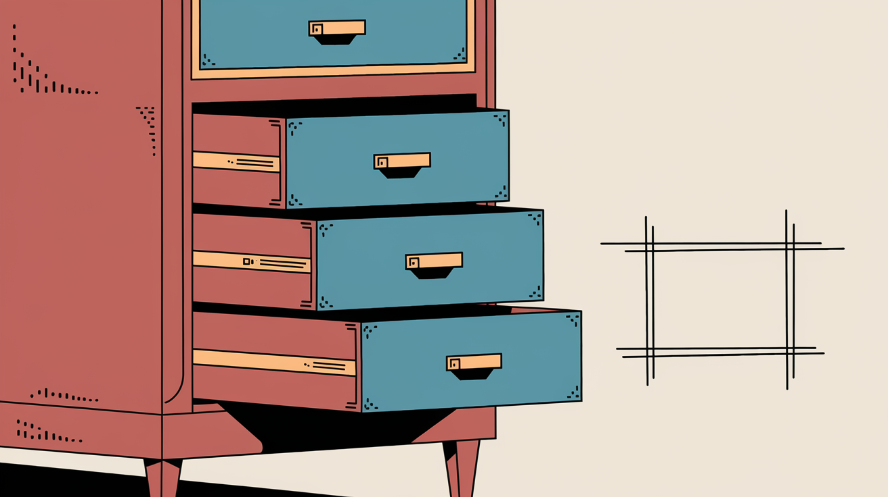

# Rectangle Drawer Chrome Extension

A Chrome extension that allows you to draw custom colored rectangles on any web page.

This repository was 99% AI generated (thanks [cline](https://github.com/cline/cline)). I left the "icon creation" setup here as is, as I found it a novel idea that allowed the AI to fully create the extension (including images).

## Features

- Draw rectangles anywhere on a web page
- Customize rectangle color and opacity
- Page-specific rectangles (each website has its own set of saved rectangles)
- Enable/disable individual rectangles with checkboxes
- Rectangles load immediately when a page opens
- Delete individual rectangles or clear all at once
- Works on any website

## Installation

1. Clone or download this repository
2. Generate icons:
   - Open `generate_icons.html` in your browser
   - Click the "Generate Icons" button
   - Create an `images` folder in the extension directory
   - Save each icon as instructed (icon16.png, icon48.png, icon128.png) in the images folder
3. Open Chrome and navigate to `chrome://extensions/`
4. Enable "Developer mode" (toggle in the top-right corner)
5. Click "Load unpacked" and select the extension directory

## Usage

1. Click the Rectangle Drawer extension icon in your browser toolbar to open the popup
2. Select the color and opacity for your rectangles
3. Toggle the "Drawing Mode" switch to enable/disable drawing
4. With drawing mode active, click and drag on any page to draw rectangles
5. Use the popup interface to clear all rectangles or delete individual ones
6. Your rectangles will persist even if you refresh the page

## How It Works

The extension creates a canvas overlay on top of the webpage, capturing mouse events to draw rectangles. The rectangles are stored using Chrome's storage API, allowing them to persist across page refreshes. The popup provides an interface for customizing the appearance of the rectangles and managing them.

## File Structure

- `manifest.json`: Extension configuration
- `popup.html` & `popup.js`: User interface for controlling the extension
- `content.js` & `content.css`: Content script for drawing rectangles on web pages
- `generate_icons.html`: Helper tool to generate extension icons
- `images/`: Directory containing extension icons

## Development

To modify this extension:

1. Make your changes to the source files
2. Reload the extension in Chrome by going to `chrome://extensions/` and clicking the refresh button for this extension
3. Test your changes

## License

MIT
